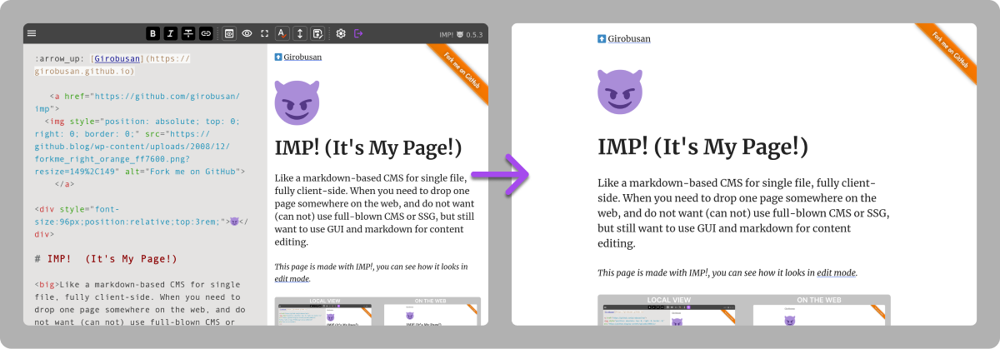

[Русский](README.ru.md)

# IMP! :imp: (It's My Page!)

<strong>Markdown when you write it. HTML when they read it.</strong>

Like a markdown-based CMS for single file, fully client-side. When you need to drop one page somewhere on the web, and do not want (can not) use full-blown CMS or SSG, but still want to use GUI for content editing.

Unlike many other project of this kind, IMP! page is **fully static by default**,
has all required SEO-tags in place and readable by any browser, even text-based.

But if you want to add interactive content to it, it's completely possible —
you can add any custom HTML, CSS and JavaScript, and/or use IMP! Helpers API for
creating more integrated custom types of content (see [examples](https://girobusan.github.io/imp-helpers/)).

→ :book: [Docs](https://girobusan.github.io/imp/)

## How it works

When you load IMP! Locally, you will see a small edit button, which opens up an editor, where you can enter or import your text, setup SEO tags and custom CSS. When the very same page is served over http, user gets a light, clean HTML. Page does not require Java Script to be viewed by default, but there is an optional API for adding interactive content. [Demo and docs](https://girobusan.github.io/imp/).

## Possible uses

- Digital experiments
- Small-scale sites
- Anywhere, where you need "just html file".

## System requirements

Descent browser, Firefox or Chrome preferred (tested). If you've updated your browser within last 4 years, it should be fine.

## Features

- Fully local thing &mdash; no server required, no setup. It's YOUR page!
- Simple Markdown editor with pixel-perfect preview and code highlighting
- Pages can be fully static, even **text-based browser friendly.**
- Custom HTML, CSS and JS allowed
- [Helpers API](https://girobusan.github.io/imp/helpers.html) for adding interactive content and other interesting things
- [Data embedding](https://girobusan.github.io/imp/data-embedding.html)
- [Customizable](https://girobusan.github.io/imp/themes/)

## CDN setup (not recommended)

1. Click [ this link ](https://girobusan.github.io/imp/impcdn.html?mode=edit)
2. Follow the instructions there.

This setup does not require downloading of any other files. Editor and main CSS will be loaded from CDN. You may load newly downloaded file in your browser, edit content and settings, save it (see below) and than upload to your server.

## Local setup (everything local, no CDN)

1. Download and unpack. There are 4 files: `index.html`, `style.css`, `imp.js` and `helpers.js`. The latter is required only for interactive content.
2. Open the `index.html` in your browser (Firefox or Chrome is recommended)
3. Edit it, import or enter your text, preview it. Click the big "Export HTML" ("Save" in newer version) button and save file to the same directory. If you didn't change file name, overwrite old file.

You may skip `imp.js` while uploading files to server, as it's not required for _viewing_ file.

## Customization

There is a field for custom CSS in each IMP! file for small adjustments. But you can replace the whole `style.css` with your own. There is nothing fancy about it.

## More files

You can have as many imps as you want. If they would live in one directory, they will share single `imp.js` file.

## Known problems

- If you use NoScript extension, you'd need to disable it for IMP! page (_not_ just set to TRUSTED mode, but disable all restrictions completely)

## License

- Mostly MIT, except:
- CC BY-CA - default theme based on Cutenberg (which is licensed under CC BY-CA)

## Wouldn't be possible without awesome projects like:

- [CodeJar](https://medv.io/codejar/)
- [Preact](https://preactjs.com/)
- [Gutenberg CSS](https://matejlatin.github.io/Gutenberg)
- [Bulma CSS framework](https://bulma.io/)
- [Jsdelivr](https://www.jsdelivr.com/)
- [Google Material Icons](https://fonts.google.com/icons)
