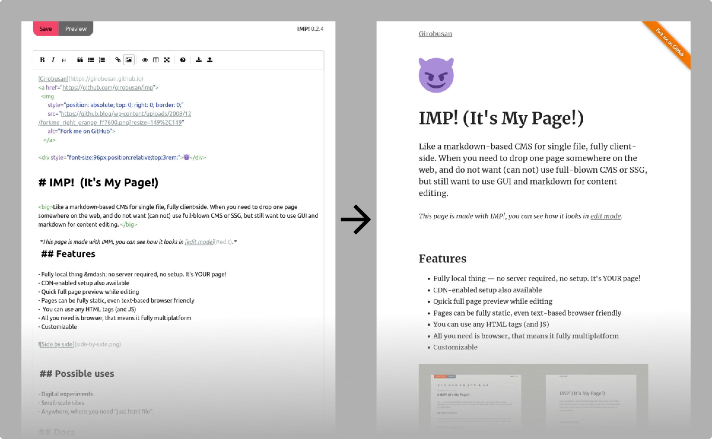

[English](README.md)
# IMP! (It's My Page! / Это моя страничка!)

 <strong>Markdown для вас, HTML для читателей. </strong>

Одностраничная "CMS" на стороне клиента. На тот случай, когда нужно выложить пару нормально сверстанных страничек, ставить полноценную CMS не хочется, но хочется редактировать контент в GUI. 

→ :book: [Документация](https://girobusan.github.io/imp/)

## Как это работает

Когда IMP открывается локально, это браузерный редактор, позволяющий редактировать текст в markdown, добавлять стили и теги для SEO. Когда _ту же страничку_ открывают по http, посетитель получает легкий **статичный** HTML. [Демо тут](https://girobusan.github.io/imp/).

## Возможные применения

- Цифровые эксперименты
- Небольшие (служебные) сайты
- Везде, где нужен "просто html". 

## Системные требования

Современный браузер, лучше Firefox или Chrome. Если вы обновляли браузер в течении
последних 4-х лет, все должно работать.

## Особенности

- Работает без серверов, сервисов, не требует настройки.
- На выходе полностью статичный, *легкий* HTML, если вы сами не добавите скриптов. 
- В текст можно включать любой HTML и добавлять скрипты.
- Нужен только браузер и локальный файл, работает на любой ОС
- EasyMDE как редактор, несколько режимов предварительного просмотра.
- Все можно [ кастомизировать ](https://girobusan.github.io/imp/themes/).
- Лоу-фай :)

## Установка с использованием CDN в два клика

1. Перейдите [по ссылке](https://girobusan.github.io/imp/impcdn.ru.html#edit)
2. Отмотайте вниз, нажмите кнопку "Duplicate page"
3. Введите желаемое имя файла с расширением html и сохраните, где нужно

Такой вариант настройки не требует скачивания дополнительных файлов. Вы можете сразу открыть полученную страничку в браузере и начать редактировать (см. ниже),
а потом закачать ее на свой сервер.

## Установка всех файлов у себя 

1. Скачайте и распакуйте. В архиве лежат три файла, `index.html`, `style.css` и `imp.js`.
2. Откройте файл index.html в браузере (Firefox или Chrome)
3. Отредактируйте все, что нужно. В редакторе есть возможность импортировать готовый файл в markdown. Нажмите на большую кнопку "Export HTML" ("Save" в новых версиях)  и сохраните файл *в ту же директорию*. Если вы не переименовывали файл, перезапишите старый.

Загрузите файлы на сервер, `imp.js` можно не загружать, он не нужен для просмотра.

## Дизайн

В каждом файле есть поле для ввода дополнительного CSS, это удобно для небольших изменений и дополнений. Но можно полностью заменить файл `style.css`, в нем нет ничего особенного. 

## Больше файлов

Можно без проблем завести несколько файлов. Если они лежат в одной директории, то им нужен один файл `imp.js`.

## Известные проблемы

- Плохо сочетается с расширением NoScript, достаточно отключить NoScript для страницы. Именно отключить все ограничения, а не просто поставить режим TRUSTED!

## Лицензии

- MIT на все, кроме:
- CC BY-CA - тема по-умолчанию на основе Gutenberg CSS

## Создано благодаря великолепным проектам

- [Preact](https://preactjs.com/)
- [EasyMDE](https://github.com/Ionaru/easy-markdown-editor)
- [Gutenberg CSS](https://matejlatin.github.io/Gutenberg)
- [Bulma CSS framework](https://bulma.io/)
- [Jsdelivr](https://www.jsdelivr.com/)
- [Google Material Icons](https://fonts.google.com/icons)
